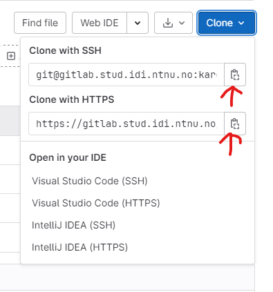
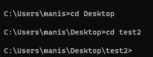
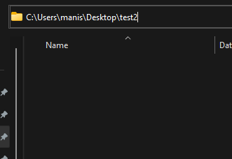
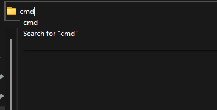
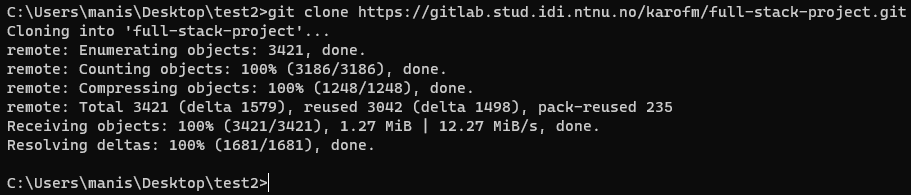
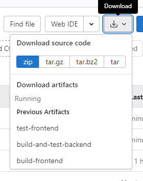
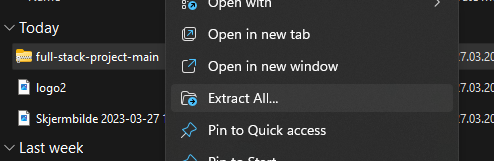
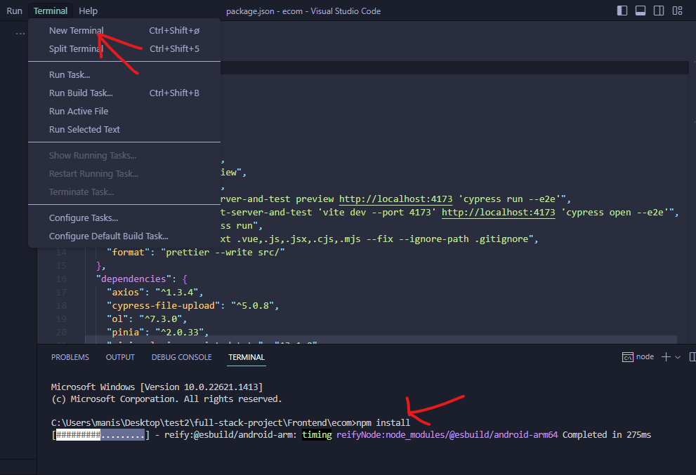
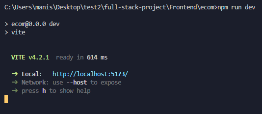
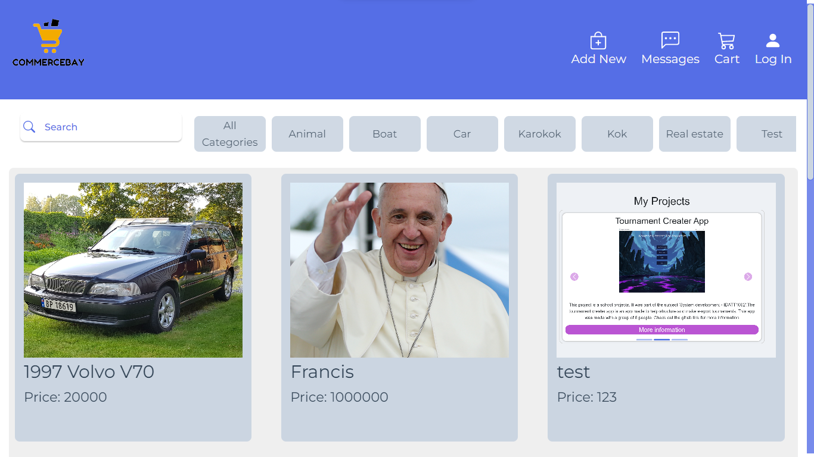

# Full Stack Project
CommersBay (trademark pending)

## Initial clone
To get this project up and running there are 2 methods we show incase 1 does not work:<br>
### Cloning with git:
For this Git is goind to be required if you don't have Git you can download it [here](https://git-scm.com/downloads).To clone with git you can use either the SSH link or HTTPS link you will find these under the code dropdown of the repository:

<br>

Then open a terminal and navigate to the location you want to clone the project(1) or go to that location and type cmd into the navigation in File Explorer(2)

1:<br>
<br>
Remember if you are confused about where you currently are you can type "dir" to get your directory and everything in it. Navigate with "cd" as you see above
<br>
<br>
2:<br>
<br>
<br>
As you can see here you navigate like normal in File Explorer then type cmd at the desired locaion.
<br>
<br>

After this use the command git clone (repo-URL)<br>
<br>
If you get a printout like that you have successfully cloned the project

### Downloading zip
To download the zip file you can click the little download icon next to the clone icon and click on zip:<br>
<br>
Note that there are other formats but we recoment zip
<br>
<br>
Find the downloaded file and extract the file<br>
<br>

## Backend Setup

## Frontend Setup
To setup frontend navigate into project folder(full-stack-project) -> Frontend -> ecom. That is the frontend vue project. Open that folder in whatever IDE you want to open it in. We recoment VS Code for this.
<br><br>
After opening the project you need to install the node modules. There is no need to install them one by one ad they are listed in package.json. To install them you need to run:
 ```
 npm install
 ```
in the terminal at location. You can open a terminal in the ecom folder as you did in previous steps or you can open it in the IDE you are working in. In VS Code you can open a terminal bu clicking terminal then new terminal:<br>
<br>
If all goes well you will have installed all the dependencies you need. After this you are ready to run frontend with the command:
```
npm run dev
```
If you do i correctly it looks like this:<br>
<br>
Opening the Local: link gives you the website. In this case typing http://localhost:5173 into your browser gives you this:<br>
<br>
Remember that to get the Items Backend needs to be running


<!-- ## Authors and acknowledgment
Show your appreciation to those who have contributed to the project.
- [Edvard Sørby](https://gitlab.stud.idi.ntnu.no/edvarso)
- [Jonatan André Vevang](https://gitlab.stud.idi.ntnu.no/jonatanv)
- [Karo Faraidoun Mahmoud](https://gitlab.stud.idi.ntnu.no/karofm)
- [Manish Mannivannan](https://gitlab.stud.idi.ntnu.no/manishma)

## Project status
If you have run out of energy or time for your project, put a note at the top of the README saying that development has slowed down or stopped completely. Someone may choose to fork your project or volunteer to step in as a maintainer or owner, allowing your project to keep going. You can also make an explicit request for maintainers. -->
